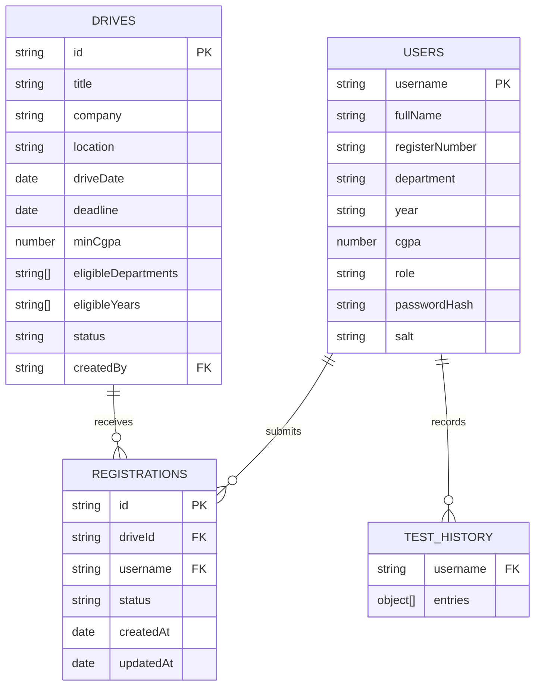

# ER diagram and data model

MongoDB collections are `users`, `drives`, `registrations`, `history` and `accessRequests`. The application uses MongoDB Atlas through `MONGODB_URI`; local development falls back to `data/app-db.json`.
